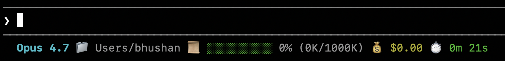

# myclaude

Personal Claude Code configuration — settings, custom scripts, and assets.

## Contents

```
~/.claude/
├── settings.json          # Claude Code user settings
├── statusline.sh          # Custom status line script
└── statusline-demo.png    # Status line screenshot
```

---

## settings.json

Global Claude Code settings.

| Key | Value | Description |
|-----|-------|-------------|
| `statusLine` | command | Runs `statusline.sh` as the status line renderer |
| `theme` | dark | UI color theme |

---

## statusline.sh

A custom status line script that renders session info after each Claude turn.



### Output fields

| Field | Description |
|-------|-------------|
| Model | Display name of the active Claude model |
| Directory | Last two segments of the current workspace path |
| Context bar | Visual fill bar (green → yellow → red) with `used%` and token counts |
| Cost | Cumulative session cost in USD |
| Duration | Total session time in minutes and seconds |

### How it works

Claude Code passes a JSON payload via stdin on each stop event. The script extracts fields with `jq`, formats them, and prints a single styled line using ANSI escape codes.

### Dependencies

- `jq` — JSON parsing (`brew install jq`)
